<!--
  ╔══════════════════════════════════════════════════════════════════╗
  ║                                                                  ║
  ║   C Y W I N S K I W E B  ·  THE DIGITAL GAZETTE                  ║
  ║   Pokaż się z dobrej strony.                                     ║
  ║                                                                  ║
  ║   Repozytorium profilu organizacji — edytorska identyfikacja     ║
  ║   wizualna. Nie edytuj tego pliku bez synchronizacji z           ║
  ║   katalogiem /assets.                                            ║
  ║                                                                  ║
  ╚══════════════════════════════════════════════════════════════════╝
-->

 

<table>
<tr>
<td align="center" width="25%">

**№ 01**
 
<i>PROJEKT</i>

</td>
<td align="center" width="25%">

**№ 02**
 
<i>KOD</i>

</td>
<td align="center" width="25%">

**№ 03**
 
<i>STRATEGIA</i>

</td>
<td align="center" width="25%">

**№ 04**
 
<i>REZULTAT</i>

</td>
</tr>
</table>

 

## <samp>W&nbsp;TYM&nbsp;WYDANIU</samp>

> *„Projektujemy i tworzymy strony internetowe — od małych landing page po zaawansowane systemy. Indywidualne podejście, nowoczesny design, globalny zasięg.”*

<table>
<tr>
<td width="33%" valign="top">

### I.&nbsp; Manifest

Wierzymy, że strona internetowa to nie koszt — to **inwestycja w pierwsze wrażenie**. Każdy projekt zaczynamy od pytania: *jak chcesz się pokazać światu?*

</td>
<td width="33%" valign="top">

### II.&nbsp; Rzemiosło

Piszemy kod, który się **skaluje**, ładuje w milisekundach i rankuje w Google. Żadnych gotowców. Żadnych kompromisów. Tylko architektura skrojona pod cel.

</td>
<td width="33%" valign="top">

### III.&nbsp; Zasięg

Warszawa jako baza, świat jako rynek. Dostarczamy projekty klientom na **trzech kontynentach** — z tą samą dbałością o detal.

</td>
</tr>
</table>

 

  

 

## <samp>PRACOWNIA&nbsp;·&nbsp;STOS&nbsp;TECHNOLOGICZNY</samp>

 

<table>
<tr>
<td width="50%" valign="top">

#### <samp>FRONT&nbsp;OF&nbsp;HOUSE</samp>

Next.js · React · TypeScript · Vite
Tailwind CSS · Framer Motion
Responsive-first · Accessibility-aware

Interfejsy, które ładują się natychmiast i **konwertują** — nie tylko wyglądają.

</td>
<td width="50%" valign="top">

#### <samp>BACK&nbsp;OF&nbsp;HOUSE</samp>

Node.js · Express · TypeScript
MongoDB · Firebase · PostgreSQL
Electron dla aplikacji desktop

Backend zbudowany pod **niezawodność** — SLA, monitoring, backupy jako standard.

</td>
</tr>
</table>

 

  

 

## <samp>KRONIKA&nbsp;·&nbsp;DANE&nbsp;Z&nbsp;PRACOWNI</samp>

<i>Wszystkie repozytoria pozostają prywatne — poniższe statystyki agregują wkład publiczny i prywatny założyciela.</i>

&nbsp;

 

 

  

 

## <samp>PORTFOLIO&nbsp;·&nbsp;WYBRANE&nbsp;REALIZACJE</samp>

<table>
<tr>
<td width="33%" valign="top" align="center">

### ◆

**Landing Pages**
 
Jednostronicowe witryny, które  sprzedają od pierwszego scrolla.

</td>
<td width="33%" valign="top" align="center">

### ■

**Serwisy firmowe**
 
Pełne strony korporacyjne  z CMS i integracjami.

</td>
<td width="33%" valign="top" align="center">

### ▲

**Systemy webowe**
 
Zaawansowane aplikacje  SaaS, panele, dashboardy.

</td>
</tr>
</table>

   
  <i>Pełne portfolio dostępne na żądanie — repozytoria prywatne ze względu na NDA klientów.</i>
    
  

 

  

 

## <samp>KONTAKT&nbsp;·&nbsp;REDAKCJA</samp>

<table>
<tr>
<td width="50%" valign="top">

### <samp>ZLECENIA&nbsp;&amp;&nbsp;WYCENY</samp>

Pracujemy z klientami, którzy traktują obecność cyfrową **poważnie**. Jeśli szukasz wykonawcy na najtańszą ofertę — nie jesteśmy dla Ciebie. Jeśli szukasz partnera, który dostarczy produkt godny Twojej marki — **porozmawiajmy**.

 

**▸** [cywinskiweb.com](https://cywinskiweb.com)

</td>
<td width="50%" valign="top">

### <samp>ŚLEDŹ&nbsp;NAS</samp>

 

  

  

</td>
</tr>
</table>

  

<table>
<tr><td align="center">

<samp>━━━━━&nbsp;&nbsp;&nbsp;◆&nbsp;&nbsp;&nbsp;━━━━━</samp>

 

*Cywinskiweb · Established MMXXV · Warszawa*
 
*„Pokaż się z dobrej strony.”*

 

© Cywinskiweb. All dispatches printed with care. All rights reserved.

</td></tr>
</table>

<!-- Profile views counter, placed discreetly at the end -->

  

