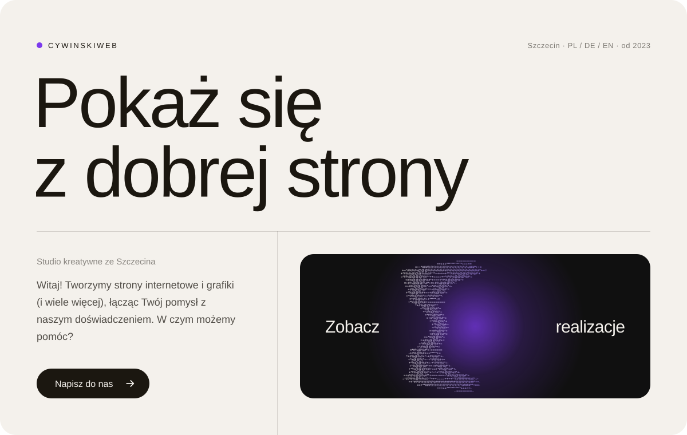
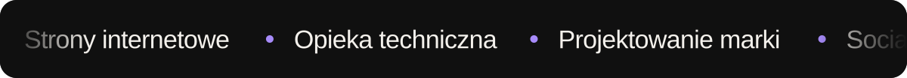
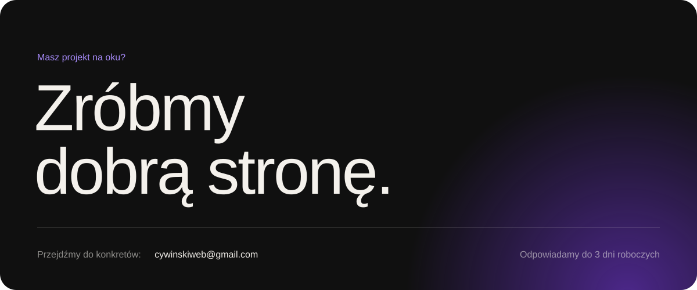

<!--
  CYWINSKIWEB — profile repo
  https://cywinskiweb.com/pl/ · Szczecin · od 2023
  Kierunek wizualny jak na stronie: Lexend, papier #F4F1EC, atrament #1B1710, ametyst #7C3AED.
-->

  

  
  
  
  
  

 

O&nbsp;studiu

### Cywinskiweb to niezależne studio ze Szczecina. Projektujemy i kodujemy strony, a potem zostajemy po wdrożeniu, z opieką techniczną i jednym kontaktem do wszystkiego.

Naszą misją jest technologia, która czuje się ludzka: strony intuicyjne, celowe i zrobione z sensem.

<table>
<tr>
<td width="33%" valign="top">

## 2023
tworzymy strony od

</td>
<td width="33%" valign="top">

## 16+
zrealizowanych projektów

</td>
<td width="33%" valign="top">

## 5.0 ★
na podstawie 8 opinii w Google

</td>
</tr>
</table>

01&nbsp;&nbsp;·&nbsp;&nbsp;Usługi

## Co robimy

Pięć kategorii usług. Każdą prowadzimy od początku do końca, a większość klientów łączy kilka.

| | Usługa | Co obejmuje | Dla kogo |
|:--|:--|:--|:--|
| 01 | **Strony internetowe** | Od budżetowych stron na builderze po projekty kodowane od zera: firmowe, sklepy, wielojęzyczne. | Dla firm, które chcą się wyróżnić i mieć realną wydajność. |
| 02 | **Opieka techniczna** | Aktualizacje, poprawki, drobne zmiany, hosting i domena. Poprawiamy też strony, których nie budowaliśmy. | Dla tych, którzy chcą mieć spokój i jeden kontakt. |
| 03 | **Projektowanie marki** | Wizytówki, ulotki, plakaty i banery, do druku i online. | Dla marek, które chcą spójny, rozpoznawalny styl. |
| 04 | **Social media** | Strategia, treści, grafiki i rolki, publikacja i raporty. | Dla firm budujących obecność, którym brakuje czasu. |
| 05 | **Meta Ads** | Kampanie na Facebooku i Instagramie: kreacja, prowadzenie, raporty. | Dla tych, którzy chcą docierać do nowych klientów. |

<table>
<tr>
<td width="33%" valign="top">

PAKIET
#### Launch
Strona plus podstawy marki (wizytówki i materiały). Dla firm startujących od zera.

</td>
<td width="33%" valign="top">

PAKIET
#### Care
Dowolna strona plus stała opieka techniczna. Dla tych, którzy nie chcą jej dotykać.

</td>
<td width="33%" valign="top">

PAKIET
#### Grow
Social media plus Meta Ads. Dla firm gotowych na marketing.

</td>
</tr>
</table>

> **Jak wygląda wycena.** Krótka rozmowa, potem stała cena za ustalony zakres. Pokazujemy widełki, nigdy jednej sztywnej kwoty z góry. Zawsze wiesz, co jest w cenie, zanim się zdecydujesz.

02&nbsp;&nbsp;·&nbsp;&nbsp;Podejście

## Dlaczego my

<table>
<tr>
<td width="33%" valign="top">

**Indywidualne podejście**

Każdy projekt traktujemy jako unikalny. Bez gotowych szablonów, wszystko projektujemy od zera.

</td>
<td width="33%" valign="top">

**Kompleksowe rozwiązania**

Od koncepcji, przez projekt i kod, po wdrożenie i opiekę. Wszystko w jednym miejscu.

</td>
<td width="33%" valign="top">

**Pełna transparentność**

Na bieżąco informujemy o postępach. Żadnych niespodzianek, jasna komunikacja.

</td>
</tr>
</table>

#### Jak prowadzimy projekt

<table>
<tr>
<td width="25%" valign="top">

01 
**Rozmowa** 
Krótkie discovery, czego naprawdę potrzebujesz.

</td>
<td width="25%" valign="top">

02 
**Projekt UX/UI** 
Projektujemy rozwiązanie, widzisz je, zanim powstanie.

</td>
<td width="25%" valign="top">

03 
**Kod** 
Kodujemy, ustawiamy hosting i domenę, wdrażamy.

</td>
<td width="25%" valign="top">

04 
**Opieka** 
Zostajemy przy aktualizacjach i zmianach.

</td>
</tr>
</table>

03&nbsp;&nbsp;·&nbsp;&nbsp;Wybrane realizacje

## Realizacje

Wybrane projekty dla małych firm w Polsce i na świecie. Strony, marki, sklepy i kampanie.

| Rok | Klient | Projekt | |
|:--|:--|:--|:--|
| 2026 | **Mitomo** | Wielojęzyczna strona (PL, EN, DE) na autorskim motywie WordPress | [Zobacz projekt ↗](https://cywinskiweb.com/pl/portfolio/mitomo/) |
| 2025 | **Autopflege Mitte** | Redesign i SEO strony premium detailingu z Berlina | [Zobacz projekt ↗](https://cywinskiweb.com/pl/portfolio/autopflegemitte/) |
| 2023 | **ICE ART** | Strona artysty z galerią obrazów w stylu irezumi | [Zobacz projekt ↗](https://cywinskiweb.com/pl/portfolio/ice-art/) |
| 2024 | **Wawer** | Landing page, katalog i wizytówka firmy | [Zobacz projekt ↗](https://cywinskiweb.com/pl/portfolio/wawer/) |
| 2024 | **Karolina Zielińska** | Strona marki osobistej i wizytówki | [Zobacz projekt ↗](https://cywinskiweb.com/pl/portfolio/karolina-zielinska/) |
| 2024 | **EarthX** | Landing i redesign strony gry z animacjami 3D | [Zobacz projekt ↗](https://cywinskiweb.com/pl/portfolio/earthx/) |
| 2025 | **Nshine** | Kampanie Meta Ads i grafiki reklamowe dla marki modowej | [Zobacz projekt ↗](https://cywinskiweb.com/pl/portfolio/nshine/) |
| 2025 | **Autobielat** | Landing page serwisu samochodowego | [Zobacz projekt ↗](https://cywinskiweb.com/pl/portfolio/autobielat/) |
| 2025 | **Jubiler Araszkiewicz** | Detaliczny sklep jubilerski | [Zobacz projekt ↗](https://cywinskiweb.com/pl/portfolio/jubileraraszkiewicz/) |
| 2025 | **Wabiz** | Strona hurtowni jubilerskiej | [Zobacz projekt ↗](https://cywinskiweb.com/pl/portfolio/wabizpl/) |

Zaufali nam: **Araszkiewicz** · **Mitomo** · **Wawer** · **Autobielat** · **Nshine** · **MTMedia** · **LoveAirPlant**

<i>Repozytoria klientów pozostają prywatne. Pełne portfolio z opisami i zrzutami ekranu jest na stronie.</i>

04&nbsp;&nbsp;·&nbsp;&nbsp;Opinie

## 5.0 w Google

<table>
<tr>
<td width="50%" valign="top">

> Świetna współpraca. Fachowe doradztwo, bardzo dobry kontakt, szybkie odpowiedzi na każde pytanie. Praca wykonana terminowo i solidnie. Polecam!
>
> **Marcin Wiejaczka**

</td>
<td width="50%" valign="top">

> Projekty są nowoczesne, czytelne i dopasowane idealnie do potrzeb klienta. Komunikacja bez zarzutu, szybko i konkretnie.
>
> **Mateusz Towarek** · MTMedia

</td>
</tr>
<tr>
<td width="50%" valign="top">

> Jakub wyróżnia się imponującą wiedzą i doskonałymi umiejętnościami interpersonalnymi. Współpraca była skuteczna i bardzo przyjemna.
>
> **inż. Filip Kępka**

</td>
<td width="50%" valign="top">

> Working with Jakub was pure pleasure. Great communication and great minimalist website design for our game!
>
> **Denis Szwarc** · EarthX

</td>
</tr>
</table>

<a href="https://g.page/r/CQUwwehJTu8hEBM">Zobacz opinie ↗</a> &nbsp;·&nbsp; <a href="https://g.page/r/CQUwwehJTu8hEAE/review">Wystaw opinię ↗</a>

05&nbsp;&nbsp;·&nbsp;&nbsp;Warsztat

## Stack i aktywność

**Next.js · React · TypeScript · Tailwind CSS · three.js** &nbsp;/&nbsp; **Node.js · Express · MongoDB · Firebase · PostgreSQL** &nbsp;/&nbsp; **WordPress · Wix · Electron**

<i>Statystyki agregują publiczny i prywatny wkład założyciela.</i>

  
  

06&nbsp;&nbsp;·&nbsp;&nbsp;Kontakt

## Napisz do nas

Napisz, czego potrzebujesz: nowej strony, poprawki, materiałów dla marki albo po prostu zadaj pytanie. Czytamy każdą wiadomość i odpowiadamy z jasnymi kolejnymi krokami.

| E-mail | Telefon | Lokalizacja | Odpowiedź |
|:--|:--|:--|:--|
| [cywinskiweb@gmail.com](mailto:cywinskiweb@gmail.com) | [+48 733 489 649](https://wa.me/48733489649) | Szczecin, Polska | do 3 dni roboczych |

Pracujemy z klientami z Polski, Niemiec i spoza Europy, w językach PL, EN i DE.

  

  

**Cywinskiweb** &nbsp;·&nbsp; Studio kreatywne. Strony i marka dla małych firm. &nbsp;·&nbsp; © 2023–2026 Wszelkie prawa zastrzeżone.

